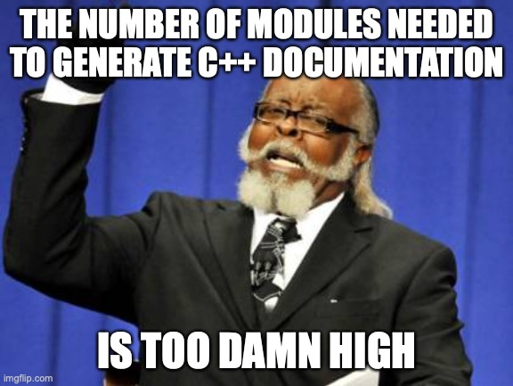

# Doxygen/CMake/Sphinx/Breathe for those of use who are totally lost

(I'm the one totally lost).

**Note** You could read all this in a nicer format on [Medium here](https://medium.com/@karlsson.vom.dach/c-documentation-with-doxygen-cmake-sphinx-breathe-for-those-of-use-who-are-totally-lost-452c9829deaa).

The goal here is to set up the documentation for a `C++` project. The end result will be documentation for `C++` library in the `ReadTheDocs` theme hosted on `GitHub`, as shown below.

[The final website is here.](https://smrfeld.github.io/cpp_doxygen_sphinx)

There will be three parts:
1. [Link](README_doxygen.md) Getting some warnings about missing documentation to appear in the build process. This will be done by incorporating `Doxygen` into `CMake`.
2. [Link](README_sphinx.md) Getting an actually nice (`ReadTheDocs`) website up and running. This will be done using the `Doxygen`/`Sphinx`/`Breathe` pipeline. I won't try to incorporate this step into the `CMake` file - it's usually done via `GitHub actions` anyways.
3. [Link](README_github.md) Getting `GitHub actions` to automatically build and host our documentation for us.

These notes are a compilation of what I learned from these nice sources, so all credit where it's due:
* [Here](https://devblogs.microsoft.com/cppblog/clear-functional-c-documentation-with-sphinx-breathe-doxygen-cmake/)
* [Here](https://vicrucann.github.io/tutorials/quick-cmake-doxygen/)
* Some million examples scattered around the web.
