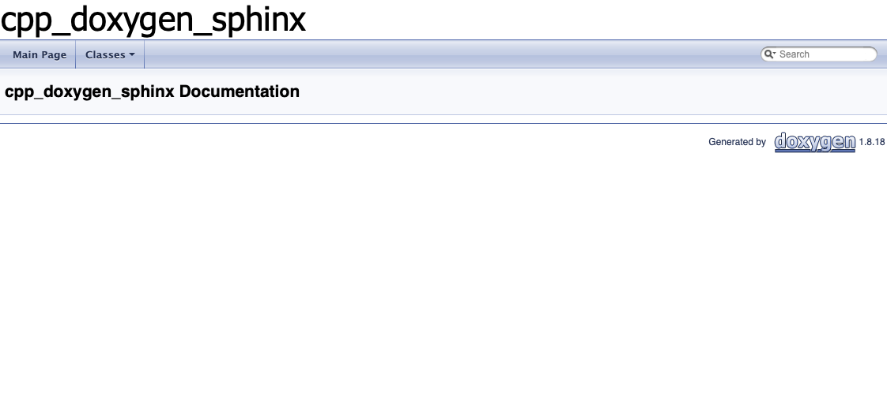

# Setting up Doxygen/CMake

The goal of this first part is to get some warnings about missing documentation to appear in the build process. This will be done by incorporating `Doxygen` into the `CMake` build process.

## Install Doxygen

If you are on Mac, use `brew`:
```
brew install doxygen
```
If you are on Windows/Linux, well, you'll figure it out :)

## Setting up CMake

If you've never used `CMake`, it's easiest to start with a generator for a basic `CMakeLists.txt` file. Open the folder in which the project will reside in `Visual Studio Code`. In the `Visual Studio Code` extensions, install the `CMake Tools` extension.

Fire up the command pallate (command-shift-P) and choose `CMake Quick Start`. Follow the prompts and enter the project name - here we will use `cpp_doxygen_sphinx`. We are going to build a library instead of an exectuable - I feel it is more common for a project you would want to document.

You should find in the directory two new files: `CMakeLists.txt` and `cpp_doxygen_sphinx.cpp`. Mine look like this:
```
cmake_minimum_required(VERSION 3.0.0)
project(cpp_doxygen_sphinx VERSION 0.1.0)

include(CTest)
enable_testing()

add_library(cpp_doxygen_sphinx cpp_doxygen_sphinx.cpp)

set(CPACK_PROJECT_NAME ${PROJECT_NAME})
set(CPACK_PROJECT_VERSION ${PROJECT_VERSION})
include(CPack)
```
and the source file:
```
#include <iostream>

void say_hello(){
    std::cout << "Hello, from cpp_doxygen_sphinx!\n";
}
```

Test that it works using your favorite IDE or the command line:
* I always like `Xcode`: in the main directory:
    ```
    rm -r build
    mkdir build
    cd build
    cmake .. -GXcode
    ```
    Open the `Xcode` project in the `build` directory. Switch the target to `build` and hit the big run button.

* VS code: run `CMake: Build` command in the pallete.
* Command line: or by heading to the `build` folder in your main directory and run:
    ```
    cd cpp_doxygen_sphinx/build
    cmake ..
    make
    ```

Using any method, make sure it builds! The output library will be in the `build` folder: `libcpp_doxygen_sphinx.a`.

## Organize the directory

Organize the directory a bit, such that the structure looks like this:
```
- include/cpp_doxygen_sphinx.hpp
- src/cpp_doxygen_sphinx.cpp
```
And edit the files such that they read: for `cpp_doxygen_sphinx.hpp`
```
#include <iostream>
#include <string>

class Foo {
    void say_hello(std::string message) const;
};
```
and the source file:
```
#include "../include/cpp_doxygen_sphinx.hpp"

void Foo::say_hello(std::string message) const {
    std::cout << "Hello: " << message << std::endl;
}
```

Also edit the `CMake` file such that it can find the sources and the headers. I edited mine as follows:
```
cmake_minimum_required(VERSION 3.0.0)

set(CMAKE_CXX_FLAGS_DEBUG "-O3 -Wall")

project(cpp_doxygen_sphinx VERSION 0.1.0)

include(CTest)
enable_testing()

# Source and header dir
set(PROJECT_SOURCE_DIR "src")
set(PROJECT_INCLUDE_DIR "include")

# Source files, without extensions or directory names
# Here assuming each file has both header and impl
set(SRC_FILES cpp_doxygen_sphinx)

# Create SOURCE_FILES
foreach(file ${SRC_FILES})
	list(APPEND SOURCE_FILES
        ${PROJECT_SOURCE_DIR}/${file}.cpp
        ${PROJECT_INCLUDE_DIR}/${file}.hpp
	)
endforeach()

# Set up such that your IDE organizes the files correctly
source_group(TREE ${CMAKE_CURRENT_SOURCE_DIR} FILES ${SOURCE_FILES})

add_library(cpp_doxygen_sphinx ${SOURCE_FILES})

set(CPACK_PROJECT_NAME ${PROJECT_NAME})
set(CPACK_PROJECT_VERSION ${PROJECT_VERSION})
include(CPack)
```
There are other ways to set up your CMake file, so don't feel constrained here.

Check that it builds again - best is to remove the old build directory first:
```
rm -r build
mkdir build
cd build
cmake ..
make
```
Or again, using the IDE.

## Add Doxygen

It's time to start with Doxygen!

In the main directory, make a directory called `docs_doxygen`, and generate a starting configuration file:
```
mkdir docs_doxygen
cd docs_doxygen
doxygen -g
```
You will have a new file called `Doxyfile`. It is common to rename it to have a `.in` extension:
```
mv Doxyfile Doxyfile.in
```
You can edit some fields in `Doxyfile.in`. The following are some useful ones:
* `PROJECT_NAME` - self explanatory, here we set `cpp_doxygen_sphinx`.
* `VERBATIM_HEADERS       = NO` - otherwise sources for header files will be included in the docs - I usually find this redundant.
* `GENERATE_LATEX         = NO` - it's on by default, but you might not need it.

Now the actual heart of the docs generation:
* `OUTPUT_DIRECTORY       = @CMAKE_CURRENT_BINARY_DIR@/docs_doxygen/` - Note that `CMAKE_CURRENT_BINARY_DIR` is the `build` directory in this case.
* `INPUT                  = @CMAKE_CURRENT_SOURCE_DIR@/@PROJECT_INCLUDE_DIR@` - Note that `CMAKE_CURRENT_SOURCE_DIR` is the main directory in this case, and we set `PROJECT_INCLUDE_DIR` to be the `include` directory from before. With this option, docs will be generated from all the headers in the `include` directory. 
* `RECURSIVE           = YES` - self explanatory.

This won't run by itself, because it needs the flags from `CMake` to understand the input/output.

Edit your `CMakeLists.txt` to append:
```
# Doxygen

# look for Doxygen package
find_package(Doxygen)

if (DOXYGEN_FOUND)
    # set input and output files
    set(DOXYGEN_IN ${CMAKE_CURRENT_SOURCE_DIR}/docs_doxygen/Doxyfile.in)
    set(DOXYGEN_OUT ${CMAKE_CURRENT_BINARY_DIR}/Doxyfile.out)

    # request to configure the file
    configure_file(${DOXYGEN_IN} ${DOXYGEN_OUT} @ONLY)
    message("Doxygen build started")

    # Note: do not put "ALL" - this builds docs together with application EVERY TIME!
    add_custom_target( docs
        COMMAND ${DOXYGEN_EXECUTABLE} ${DOXYGEN_OUT}
        WORKING_DIRECTORY ${CMAKE_CURRENT_BINARY_DIR}
        COMMENT "Generating API documentation with Doxygen"
        VERBATIM )
else (DOXYGEN_FOUND)
  message("Doxygen need to be installed to generate the doxygen documentation")
endif (DOXYGEN_FOUND)
```

Here, we made a new custom build target called `docs` which will build the docs. You could add the `ALL` flag instead if you always want to build the docs (but do you really want to see all those warnings?).

You can test it using your favorite IDE:
* I always like `Xcode`. In the main directory:
    ```
    rm -r build
    mkdir build
    cd build
    cmake .. -GXcode
    ```
    Open the `Xcode` project in the `build` directory. Switch the target to `docs` and you should see some errors about the docs!

* In Visual Studio, run in the command pallette
    ```
    CMake: Build Target
    ```
    and select the `docs` target (probably at the very bottom).

* Use the command line - in the `build` directory:
    ```
    cmake ..
    make docs
    ```

Using any method, in the `build` directory you should find a new folder `docs_doxygen`. Inside should be the `html` folder. Opening up `index.html` gives you your shiny documentation website.

You can also verify in the `build/Doxyfile.out` file that the `INPUT` and `OUTPUT_DIRECTORY` paths have been set correctly.

You should be getting some warnings that things are not documented like:
```
Compound: Foo is not documented
``` 
Great! Let's fix that next. Edit your header to add some docs:
```
#include <iostream>
#include <string>

/// Foo
class Foo {

    /// Say hello
    /// @param message The message to print
    void say_hello(std::string message) const;

};
```
Build again.

Hopefully your warnings have gone away, and your `index.html` contains some nice(r) documentation. Mine looks like:


That's all for this first part. We won't try to get the Doxygen website to look any nicer - here it is just such that some warning can appear in the build telling you that you didn't comment anything. For the actual website, we will use `Sphinx/ReadTheDocs/Breathe`, as described in the [next part](README_sphinx.md).