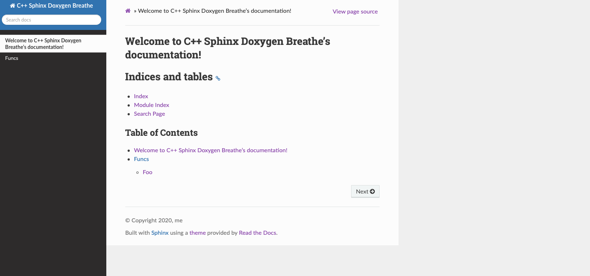

# GitHub Actions for automagically deploying your website

This final part will be about getting GitHub actions to automagically deploy your website. See the [previous part](README_sphinx.md) to set up the `Doxygen`/`Sphinx`/`Breathe` pipeline first.

The resulting website will be **public to the web**, even if the project is private. This is a limitation of GitHub. If you would like you can use GitLab instead, which lets you host a password protected private website for documenting your private repo, which is pretty cool!

## Git

If you haven't already, initialize a `git` repo for your project:
```
git init .
```
A good `.gitignore` would be:
```
.vscode/
.DS_Store
build/
_build/
_static/
_templates/
```
With these I was able for our toy project to just
```
git add .
git commit -m "Initial commit"
```

Obviously we need a GitHub repo, so go ahead and make one. I called mine `cpp_doxygen_sphinx` (surprise). See the note above if you are making it a private repo.

Use the instructions to push your initial commit to GitHub.

## GitHub Actions

`GitHub Actions` are fancy because there is a great marketplace of predefined actions for us to use, so we don't have to play around with it too much.

`GitHub Actions` are **not** fancy because there is no good way to test your actions "offline" (except [here](https://github.com/nektos/act), but it's kind of a pain). You can however sort of debug them while they are running use the excellent [mxschmitt/action-tmate@v2](https://github.com/mxschmitt/action-tmate) action - more on that below.

We are going to use [this great Deploy to GitHub Pages action](https://github.com/marketplace/actions/deploy-to-github-pages). Go ahead and navigate there, click use latest. You can see the snippet that we will use.

To set this up, go to our main directory and make two new directories
```
mkdir .github
mkdir .github/workflows
```
All the workflows will live in here.

Make the workflow for generating our documentation - it should be a new file `.github/workflows/docs.yml`.

Open `docs.yml` and edit it such that it reads
```
name: Docs

on:
  #push:
  #  branches-ignore:
  #    - '**'  
  push:
    branches: [ master ]
  pull_request:
    branches: [ master ]
  
jobs:
  build:

    runs-on: macos-latest

    steps:
    - name: Requirements
      run: brew install doxygen
        && brew install sphinx-doc
        && pip3 install sphinx-rtd-theme
        && pip3 install breathe
        && pip3 install sphinx-sitemap
    - name: Checkout repo
      uses: actions/checkout@1.0.0
    - name: Build docs
      run: cd docs_sphinx
        && make html
        && cd _build/html
        && touch .nojekyll
    - name: Deploy
      uses: JamesIves/github-pages-deploy-action@releases/v3
      with:
        GITHUB_TOKEN: ${{ secrets.GITHUB_TOKEN }}
        BRANCH: gh-pages # The branch the action should deploy to.
        FOLDER: docs_sphinx/_build/html # The folder the action should deploy.
```
Breaking it down:
* The action is triggered on push to the master branch. Generally you should be pushing most commits to other branches anyways, so this action should only run occasionally when the main code branch is updated. Those commented out lines can be used to disable the action.
* `Requirements`: Some stuff comes pre-installed on the image, some doesn't. Luckily `brew` and `pip` do, but `doxygen` and `sphinx` and such - well you are on your own! The complete list of pre-installed software is [here](https://github.com/actions/virtual-environments/blob/master/images/macos/macos-10.15-Readme.md). Note that we used `pip3` for `python3`.
* `Checkout repo`: An important step. This didn't use to be required, but now it is so beware!
* `Build docs`: This builds the docs just like before, with one very important addition:
    GitHub pages uses Jekyll to build it's websites, which ignores directories that start with a `_`. This is a problem because many of the files we care about like `.js` and `.css` files are in the `_static` folder. The easy workaround is to disable Jekyll entirely with:
    ```
    ...
    && cd _build/html
    && touch .nojekyll
    ```
    As I learned [here](https://stackoverflow.com/a/39691475/1427316) (as always, answers to all of life's problems can be found on stack overflow!).

* `Deploy`: This deploys the `docs_sphinx/_build/html` folder.

Add it to the `git` repo and push:
```
git add .github
git commit -m "Docs"
git push
```

## Check online

Check online on your `GitHub` page under `Actions` at the top. You should see the latest `Docs` action running (or finished). You can check the output logs of each step and see where it failed. If it throws some errors, see the next section to debug the actions.

If everything worked, you should now have a fancy GitHub page! You will notice that there is a new branch called `gh-pages`. This branch will look very different - it will just be the website pages.

You can find your website online at:
```
https://username.github.io/project-name/
```
Note that the `project-name` is case sensitive, 

If it doesn't show up, try going to the settings on GitHub and turning the pages on/off (select a different branch like `master`, and then back to `gh-pages`).

Below is mine.



## Debugging your action

You can try to use [here](https://github.com/nektos/act) to debug the actions a little, but it is generally a headache, and probably will be easier to just edit and push.

You can sort of debug your action using `tmate` using the following [mxschmitt/action-tmate@v2](https://github.com/mxschmitt/action-tmate) action - create a new one called `.github/workflows/ssh.yml` with contents:
```
name: CI
on: [push]
jobs:
  build:
    runs-on: macos-latest
    steps:
    - uses: actions/checkout@v2
    - name: Setup tmate session
      uses: mxschmitt/action-tmate@v2
```
After you commit and push, you can navigate to the Actions page on GitHub and see the `ssh` address of your environment. You can `ssh` using a terminal and get a live way to configure and build your action. Make sure you **cancel the action at some point**, else it will run forever.

Note that you can **disable** your actions by changing them to
```
push:
    branches-ignore:
    - '**'  
```

To save on time spent installing prerequisites, you can try to use the [GitHub artifacts](https://help.github.com/en/actions/configuring-and-managing-workflows/persisting-workflow-data-using-artifacts).
