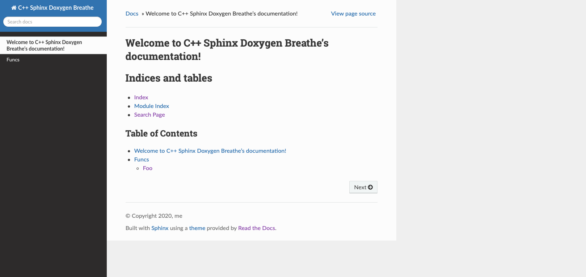
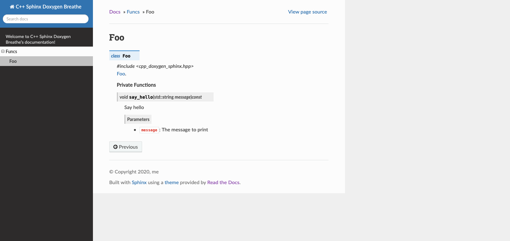

# Setting up Doxygen/Sphinx/ReadTheDocs/Breathe

This next part will be about getting an actually good looking website out there using Doxygen/Sphinx/ReadTheDocs/Breathe (oof).

Note that we won't incorporate this into the `CMake` process. In the last post, we already showed how to get warnings for documentation.

## Install prerequisites

Make sure you have all the needed tools installed:
* Doxygen as before:
    ```
    brew install doxygen
    ```
* Sphinx:
    ```
    brew install sphinx-doc
    ```
* [Read the Docs Sphinx Theme](https://sphinx-rtd-theme.readthedocs.io/en/stable/):
    ```
    pip install sphinx-rtd-theme
    ```
* [Breathe](https://github.com/michaeljones/breathe)
    ```
    pip install breathe
    ```
* Any other `Sphinx` configuration packages you may want, e.g.:
    ```
    pip3 install sphinx-sitemap
    ```

## Setting up the project

From the previous post, your project should already have the following:
```
CMakeLists.txt
docs_doxygen/Doxyfile.in
include/cpp_doxygen_sphinx.hpp
src/cpp_doxygen_sphinx.cpp
```
**But:** The only parts you will really need for the next part are:
```
include/cpp_doxygen_sphinx.hpp
src/cpp_doxygen_sphinx.cpp
```
To refresh your memory, we had for the contents of the header file:
```
#include <iostream>
#include <string>

/// Foo
class Foo {

    /// Say hello
    /// @param message The message to print
    void say_hello(std::string message) const;

};
```
and the implementation
```
#include "../include/cpp_doxygen_sphinx.hpp"

void Foo::say_hello(std::string message) const {
    std::cout << "Hello: " << message << std::endl;
}
```

Make a new directory called `docs_sphinx`:
```
mkdir docs_sphinx
cd docs_sphinx
```
Fire up the quickstart:
```
sphinx-quickstart
```
Follow the prompts. I chose:
* Seperate...: n
* Project name: C++ Sphinx Doxygen Breathe
* Author name(s): me
* Project release: []
* Language: english

Your directory `docs_sphinx` should look like this:
```
Makefile
_build/
_static/
_templates/
conf.py
index.rst
make.bat
```

You can already try to make the docs:
```
make html
```
The output will be in `_build/html/index.html`.

## Change the theme

Currently it generates docs with the `Alabaster` theme - let's change it to `ReadTheDocs`. 

Edit `conf.py` where before it read:
```
# The theme to use for HTML and HTML Help pages.  See the documentation for
# a list of builtin themes.
#
html_theme = 'alabaster'
```
now it should read:
```
# The theme to use for HTML and HTML Help pages.  See the documentation for
# a list of builtin themes.
#
html_theme = 'sphinx_rtd_theme'
html_theme_options = {
    'canonical_url': '',
    'analytics_id': '',
    'display_version': True,
    'prev_next_buttons_location': 'bottom',
    'style_external_links': False,
    
    'logo_only': False,

    # Toc options
    'collapse_navigation': True,
    'sticky_navigation': True,
    'navigation_depth': 4,
    'includehidden': True,
    'titles_only': False
}
# html_logo = ''
# github_url = ''
# html_baseurl = ''
```
You could fill out the bottom three options later.

Try again:
```
make html
```
Now `_build/html/index.html` should look better!

## Hook it up to your C++ code via output from Doxygen via Breathe

Now for the heart of the matter: we are going to use `Breathe` to hook up the output from `Doxygen` to your `Sphinx` nonsense.

For clarity we will start over, but you could copy over the `Doxygen.in` file from the last part and make some edits.

Run in the `docs_sphinx` directory:
```
doxygen -g
mv Doxyfile Doxyfile.in
```
Edit the following fields in `Doxyfile.in`:
You can edit some fields in `Doxyfile.in`. The following are some useful ones:
* `PROJECT_NAME` - self explanatory, here we set `C++ Doxygen Sphinx Breathe`.
* `VERBATIM_HEADERS       = NO` - otherwise sources for header files will be included in the docs - I usually find this redundant.
* `GENERATE_LATEX         = NO` - it's on by default, but you might not need it.
* `OUTPUT_DIRECTORY       = "_build"` - the output directory.
* `INPUT                  = "../include/"` - the input header files.
* `RECURSIVE              = YES` - self explanatory.
* `GENERATE_XML           = YES` - **make sure you turn this on**. Breathe uses the `xml` output.

This sets up Doxygen. You can fire it up and see that it works:
```
doxygen Doxyfile.in
```
Check `_build/html/index.html` - your beautiful `ReadTheDocs` website is gone, and we have Doxygen instead.

Now we will need to hook up the output from `Doxygen` to `Sphinx` via `Breathe`. Edit your `conf.py` such that the complete file reads:
```
# Configuration file for the Sphinx documentation builder.
#
# This file only contains a selection of the most common options. For a full
# list see the documentation:
# https://www.sphinx-doc.org/en/master/usage/configuration.html

# -- Path setup --------------------------------------------------------------

# If extensions (or modules to document with autodoc) are in another directory,
# add these directories to sys.path here. If the directory is relative to the
# documentation root, use os.path.abspath to make it absolute, like shown here.
#
# import os
# import sys
# sys.path.insert(0, os.path.abspath('.'))
from sphinx.builders.html import StandaloneHTMLBuilder
import subprocess, os

# Doxygen
subprocess.call('doxygen Doxyfile.in', shell=True)

# -- Project information -----------------------------------------------------

project = 'C++ Sphinx Doxygen Breathe'
copyright = '2020, me'
author = 'me'


# -- General configuration ---------------------------------------------------

# Add any Sphinx extension module names here, as strings. They can be
# extensions coming with Sphinx (named 'sphinx.ext.*') or your custom
# ones.
extensions = [
    'sphinx.ext.autodoc',
    'sphinx.ext.intersphinx',
    'sphinx.ext.autosectionlabel',
    'sphinx.ext.todo',
    'sphinx.ext.coverage',
    'sphinx.ext.mathjax',
    'sphinx.ext.ifconfig',
    'sphinx.ext.viewcode',
    'sphinx_sitemap',
    'sphinx.ext.inheritance_diagram',
    'breathe'
]

# Add any paths that contain templates here, relative to this directory.
templates_path = ['_templates']

# List of patterns, relative to source directory, that match files and
# directories to ignore when looking for source files.
# This pattern also affects html_static_path and html_extra_path.
exclude_patterns = ['_build', 'Thumbs.db', '.DS_Store']

highlight_language = 'c++'

# -- Options for HTML output -------------------------------------------------

# The theme to use for HTML and HTML Help pages.  See the documentation for
# a list of builtin themes.
#
html_theme = 'sphinx_rtd_theme'
html_theme_options = {
    'canonical_url': '',
    'analytics_id': '',  #  Provided by Google in your dashboard
    'display_version': True,
    'prev_next_buttons_location': 'bottom',
    'style_external_links': False,
    
    'logo_only': False,

    # Toc options
    'collapse_navigation': True,
    'sticky_navigation': True,
    'navigation_depth': 4,
    'includehidden': True,
    'titles_only': False
}
# html_logo = ''
# github_url = ''
# html_baseurl = ''

# Add any paths that contain custom static files (such as style sheets) here,
# relative to this directory. They are copied after the builtin static files,
# so a file named "default.css" will overwrite the builtin "default.css".
html_static_path = ['_static']

# -- Breathe configuration -------------------------------------------------

breathe_projects = {
	"C++ Sphinx Doxygen Breathe": "_build/xml/"
}
breathe_default_project = "C++ Sphinx Doxygen Breathe"
breathe_default_members = ('members', 'undoc-members')
```

Breaking it down:
* The first part under `Path setup` runs `Doxygen`.
* We added a bunch of extensions including breathe.
* We added the language for highlighting code as `c++`.
* We configured `breathe`.

This is **almost** ready to go. If you fire up `Sphinx`:
```
make html
```
you should see output from both `Doxygen` and `Sphinx`. Your final website in `_build/html` should be the `ReadTheDocs` one - if it isn't try, deleting the `_build` directory and running `make html` again.

However, no docs are displayed.

## Getting the docs to display

In `Sphinx` you can be more "flexible", which means you need to add sources manually....

In the `docs_sphinx` directory, make a new folder:
```
mkdir api
```
Add two files to the `api` folder: `index.rst` with contents:
```
.. _api:

API
===

.. toctree::
    :maxdepth: 2
    :glob:

    *
```
and `cpp_doxygen_sphinx.rst` with contents:
```
.. _api_foo:

Foo
===

.. doxygenfile:: cpp_doxygen_sphinx.hpp
   :project: C++ Sphinx Doxygen Breathe
```
Finally, edit the `index.rst` in the **main** directory such that it can find these files:
```
.. C++ Sphinx Doxygen Breathe documentation master file, created by
   sphinx-quickstart on Wed Jun 24 11:46:27 2020.
   You can adapt this file completely to your liking, but it should at least
   contain the root `toctree` directive.

Welcome to C++ Sphinx Doxygen Breathe's documentation!
======================================================

.. toctree::
   :maxdepth: 2
   :caption: Contents:


Indices and tables
==================

* :ref:`genindex`
* :ref:`modindex`
* :ref:`search`


Table of Contents
^^^^^^^^^^^^^^^^^

.. toctree::
    :maxdepth: 2

    self
    api/index
```

Now you can finally run:
```
make html
```
Hopefully there will be no errors!

## Result

Your final `_build/html/index.html` should look like this:


Clicking on the `Foo` class should give you some nice docs:


Now you can dive into the horror that is `rst` to make your docs great again.

## Next

[In the next part](README_github.md), we will use GitHub to host your website, and setup GitHub Actions such that it automatically updates your docs when you push.